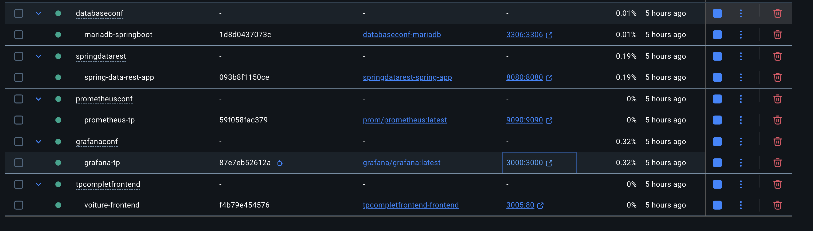
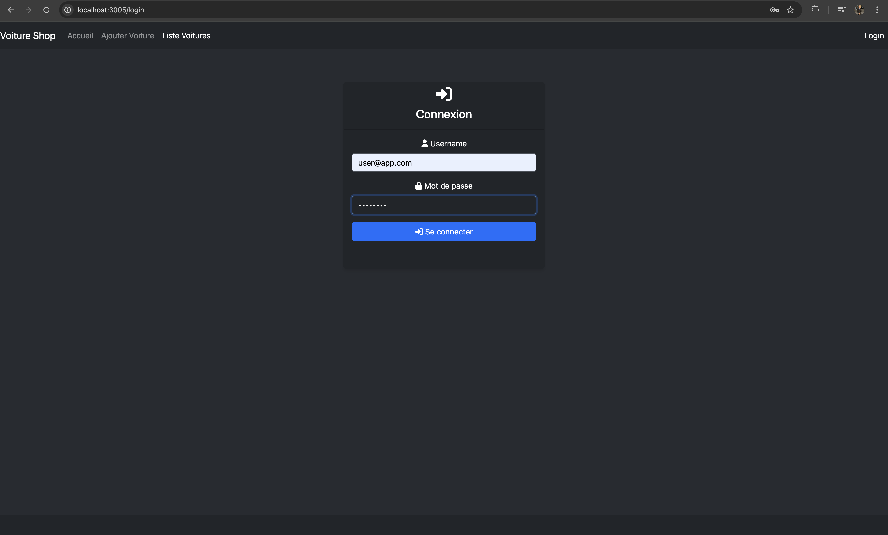
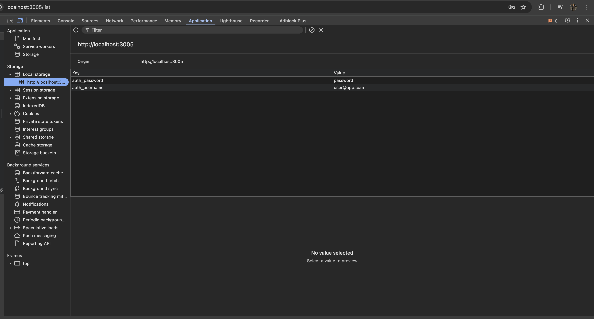
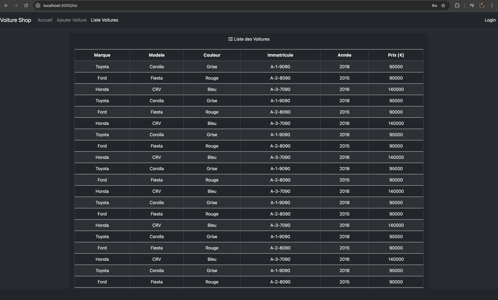
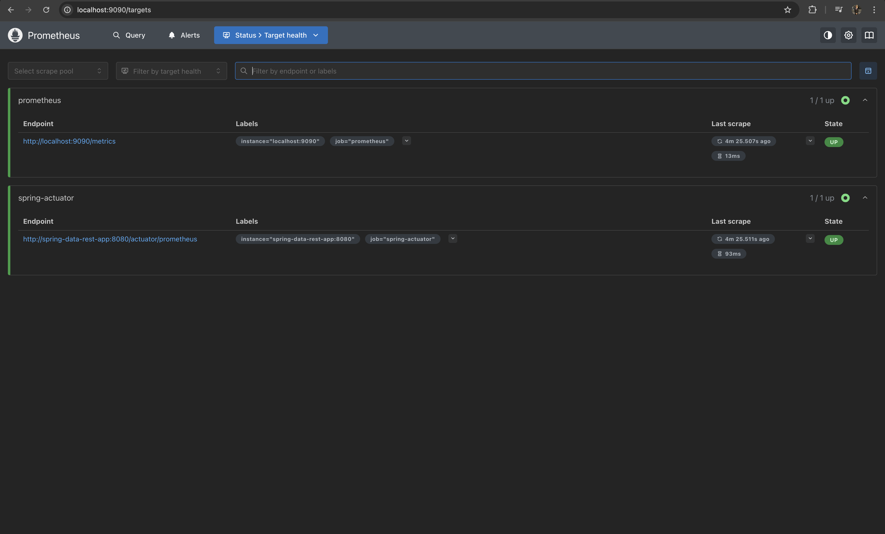
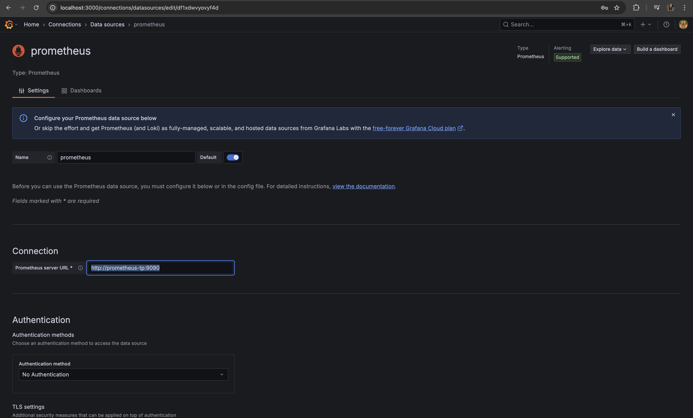
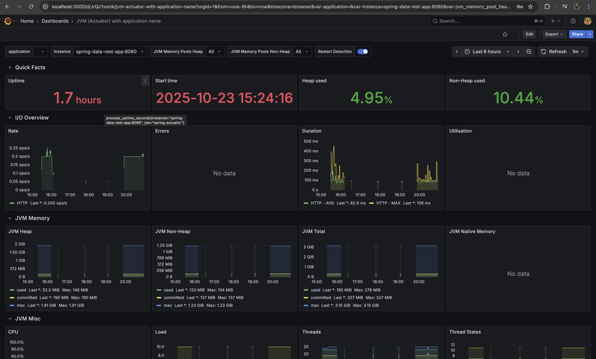

# Spring React Monitoring

Projet démonstratif full‑stack: une application composée d'un backend Spring Boot (Java 17) et d'un frontend React, containerisée avec Docker Compose et observée via Prometheus + Grafana.

## Composants
- Backend (Spring Boot) : service Java exposant une API REST sous `/api` et endpoint Actuator `/actuator/prometheus` pour métriques. Packaging via Maven, image Docker basée sur le JAR construit.
- Frontend (React) : application React buildée en statique et servie via une image Nginx (dossier `frontend/build` copié dans l'image).
- MariaDB : base de données relationnelle contenant les données d'application (propriétaires, voitures). Volume persistant configuré dans docker-compose.
- Prometheus : collecte les métriques exposées par le backend (Actuator) et par Prometheus lui‑même.
- Grafana : interface graphique pour visualiser les métriques stockées par Prometheus (dashboards, alerting).

## Interaction entre les images Docker (flux entre 5 images)

1. Frontend (nginx) ↔ Backend (spring-boot)
   - Le frontend (fichiers statiques servis par Nginx) effectue des appels HTTP vers l'API du backend sur `/api/*`.
   - En local, Docker Compose place les deux conteneurs sur le même réseau `tp-complet`, ce qui permet au frontend d'appeler le backend via le nom de service (p.ex. `http://spring-data-rest-app:8080/api/`).

2. Backend ↔ MariaDB
   - Le backend utilise JDBC (MariaDB driver) pour se connecter à la base de données MariaDB (service `mariadb`) via `jdbc:mariadb://mariadb-springboot:3306/springboot`.
   - Les données persistantes (propriétaires, voitures) sont stockées dans un volume Docker `mariadb_data` pour persistance.

3. Prometheus ↔ Backend
   - Prometheus scrape le backend via le `metrics_path` `/actuator/prometheus` configuré dans `prometheus.yml`.
   - Si le backend nécessite une authentification pour les métriques, Prometheus peut être configuré pour utiliser `basic_auth` (à externaliser pour la sécurité).

4. Grafana ↔ Prometheus
   - Grafana est configurée pour utiliser Prometheus comme datasource. Les dashboards Grafana lisent les métriques stockées par Prometheus et affichent visualisations et alertes.

5. Réseau & découverte
   - Docker Compose crée un réseau isolé `tp-complet` et tous les services sont connectés à ce réseau. Les services communiquent entre eux par leurs noms de service définis dans les fichiers `docker-compose.yml`.

## Démarrage local (étapes détaillées)

### 1. Préparation
Importer tout le projet et préparer les builds :

**Backend (Spring Boot) :**
```bash
cd "TP Complet/backend/SpringDataRest"
mvn clean package
```

**Frontend (React) :**
```bash
cd "Tp Complet Frontend/frontend"
npm install
npm run build
```

### 2. Base de données (MariaDB)
Démarrer la base de données en premier :
```bash
cd "TP Complet/backend/Database Conf"
docker-compose up -d
```

### 3. Backend (Spring Boot)
Une fois la base de données up, lancer l'application Spring Boot :
```bash
cd "TP Complet/backend/SpringDataRest"
docker-compose up -d
```

### 4. Prometheus
Lancer Prometheus pour la collecte de métriques :
```bash
cd "TP Complet/backend/Prometheus Conf"
docker-compose up -d
```

### 5. Grafana
Lancer Grafana pour la visualisation :
```bash
cd "TP Complet/backend/Grafana Conf"
docker-compose up -d
```

### 6. Frontend (React/Nginx)
Enfin, construire et lancer le frontend :
```bash
cd "Tp Complet Frontend"
docker-compose build
docker-compose up -d
```

### 7. Vérification
Une fois tous les services démarrés, vous devriez voir une image similaire à celle-ci dans Docker Desktop :



**Accès aux services :**
- Frontend : http://localhost:3005 (ou port configuré)
- Backend API : http://localhost:8080/api
- Prometheus : http://localhost:9090
- Grafana : http://localhost:3000 (admin/admin par défaut)
- MariaDB : localhost:3306

## Test de l'application frontend

### 1. Accès à l'interface de connexion
Une fois tous les services démarrés, accédez au frontend à l'adresse http://localhost:3005/login

Vous verrez l'interface de connexion suivante :



### 2. Authentification
Utilisez les credentials configurés dans le backend Spring Security (`application.properties`) :

- **Username :** `user@app.com`
- **Mot de passe :** `password`

Ces credentials correspondent à la configuration Spring Security :
```properties
spring.security.user.name=user@app.com
spring.security.user.password=password
```

### 3. Vérification de l'authentification
Après connexion réussie, vous pouvez vérifier que l'authentification est stockée dans le localStorage du navigateur :



### 4. Test des fonctionnalités
Une fois connecté, vous pouvez tester les fonctionnalités de l'application :
- Consulter la liste des voitures
- Ajouter une nouvelle voiture
- Modifier les informations existantes



## Configuration du monitoring (Prometheus + Grafana)

### 1. Vérification de Prometheus
Après avoir démarré tous les services, vérifiez que Prometheus collecte correctement les métriques :

1. Accédez à l'interface Prometheus : http://localhost:9090
2. Vérifiez le statut des targets dans **Status > Targets**
3. Vous devriez voir les services configurés dans `prometheus.yml` :
   - `prometheus` (lui-même)
   - `spring-actuator` (votre application Spring Boot)



### 2. Configuration de Grafana

#### Connexion du datasource Prometheus
1. Accédez à Grafana : http://localhost:3000
2. Connectez-vous avec les credentials par défaut : `admin` / `admin`
3. Allez dans **Configuration > Data Sources**
4. Ajoutez un nouveau datasource de type **Prometheus**
5. Configurez l'URL : `http://prometheus-tp:9090`



> **Note :** L'URL `http://prometheus-tp:9090` utilise le nom du service Docker défini dans le `docker-compose.yml` de Prometheus. Cela permet à Grafana de communiquer avec Prometheus via le réseau Docker interne.

#### Import du dashboard Spring Boot Actuator
1. Allez dans **Create > Import**
2. Utilisez l'ID de dashboard Grafana Labs : **13694**
3. Ce dashboard est spécialement conçu pour les métriques Spring Boot Actuator
4. Sélectionnez le datasource Prometheus configuré précédemment
5. Cliquez sur **Import**



### 3. Métriques disponibles
Le dashboard 13694 affiche les métriques essentielles de votre application Spring Boot :
- **JVM Memory** : Utilisation mémoire heap/non-heap
- **CPU Usage** : Utilisation processeur
- **HTTP Requests** : Nombre et durée des requêtes
- **Database Connections** : Pool de connexions DB
- **Actuator Endpoints** : Santé de l'application

### 4. Configuration avancée
Pour personnaliser la collecte de métriques, vous pouvez modifier :
- `TP Complet/backend/Prometheus Conf/prometheus.yml` : Configuration des cibles à scraper
- `application.properties` : Exposition des endpoints Actuator et fréquence des métriques

## Notes de sécurité et production
- Ne pas committer de secrets dans le repo. Utiliser des variables d'environnement ou un secret manager.
- Restreindre CORS et endpoints Actuator en production.
- Remplacer `ddl-auto=update` par migrations gérées (Flyway / Liquibase) pour éviter dérives du schéma.

---

Ce README est un point de départ : je peux l'étendre avec un diagramme d'architecture (SVG), exemples de commandes CI/CD (GitHub Actions) et un guide pour provisionner dashboards Grafana si tu veux. Veux‑tu que j'ajoute ces sections maintenant ?
